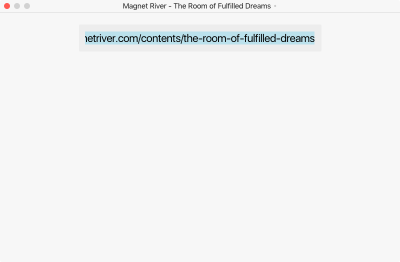
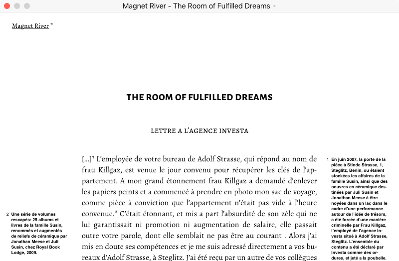
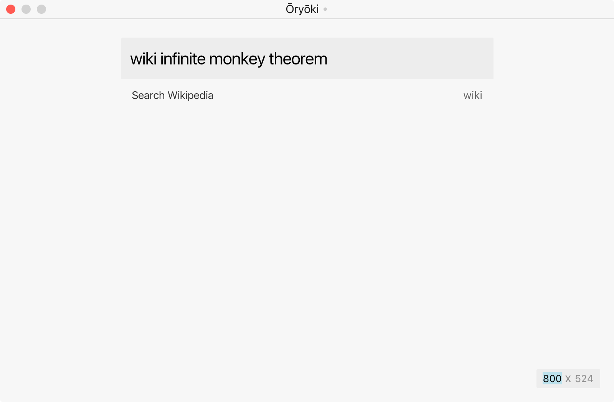

<p align='center'>
  
</p>

#### ōryōki

---

Ōryōki [応量器] is an **experimental** web browser with a thin interface.

Use it to quietly browse the Internet, archive and capture visuals. Use it to tune down the noise—so maybe don’t use it too often.

Ōryōki is an [Electron](https://electron.atom.io/) app, meaning that it more or less renders like Chrome, and that all websites are safely sandboxed in a `webview`. Only for MacOS (for now).

<br />

<h3 align='center'>⚆⚆</h3>

<br />

<p align='center'>
	
	<br /><br />
	
	<br /><br />
	
	<br /><br />
</p>

#### features

---

→ See [user manual](https://github.com/thmsbfft/oryoki/blob/master/USER-MANUAL.md) for a more complete run through.

* Frameless browsing
* Picture in picture
* Magic screenshots
* Video recording
* Visual filters (invert, grayscale)
* Night mode
* Devtools
* Search dictionary

#### shortcuts

---

| what                               | how                                                             |
| :--------------------------------- | :-------------------------------------------------------------- |
| *• navigation*                     |                                                                 |
| toggle omnibox                     | <kbd>cmd</kbd> <kbd>L</kbd>                                     |
| direct search                      | <kbd>ctrl</kbd> <kbd>return</kbd>                               |
| *• window management*              |                                                                 |
| toggle title bar                   | <kbd>cmd</kbd> <kbd>/</kbd>                                     |
| toggle window helper               | <kbd>cmd</kbd> <kbd>alt</kbd> <kbd>M</kbd>                      |
| cycle thru windows                 | <kbd>ctrl</kbd> <kbd>tab</kbd>                                  |
| apply preset size                  | <kbd>cmd</kbd> <kbd>1, 2, 3, etc.</kbd>                         |
| *• image*                          |                                                                 |
| save screenshot                    | <kbd>cmd</kbd> <kbd>shift</kbd> <kbd>~</kbd>                    |
| copy screenshot                    | <kbd>cmd</kbd> <kbd>shift</kbd> <kbd>C</kbd>                    |
| start recording                    | <kbd>cmd</kbd> <kbd>shift</kbd> <kbd>P</kbd>                    |
| stop recording                     | <kbd>cmd</kbd> <kbd>alt</kbd> <kbd>shift</kbd> <kbd>P</kbd>     |
| *• utilities*                      |                                                                 |
| open preferences                   | <kbd>cmd</kbd> <kbd>,</kbd>                                     |
| toggle night mode                  | <kbd>cmd</kbd> <kbd>ctrl</kbd> <kbd>N</kbd>                     |
| toggle mini console                | <kbd>cmd</kbd> <kbd>alt</kbd> <kbd>C</kbd>                      |
| filter: invert                     | <kbd>cmd</kbd> <kbd>I</kbd>                                     |
| filter: grayscale                  | <kbd>cmd</kbd> <kbd>G</kbd>                                     |

#### status

---

Beta. Developed by [@thmsbfft](https://twitter.com/thmsbfft).

#### build from source

----

Latest updates and work-in-progress features are on the [dev](https://github.com/thmsbfft/oryoki/tree/dev) branch.

```
# clone the project
git clone https://github.com/thmsbfft/oryoki.git

# checkout /dev
git branch -a
git checkout dev

# install dependencies
npm install

# package the app
npm run package
```

→ `/build/Oryoki-darwin-x64/Oryoki.app`

#### contributing

---

Feedback and suggestions welcome here, or write@oryoki.io.

---

#### license → [mit](LICENSE.md)